# PlanetDiscovery

<a name="readme-top"></a>

<!-- TABLE OF CONTENTS -->
<details>
  <summary>Table of Contents</summary>
  <ol>
    <li>
      <a href="#about-the-project">About The Project</a>
      <ul>
        <li><a href="#built-with">Built With</a></li>
      </ul>
    </li>
    <li>
      <a href="#getting-started">Getting Started</a>
      <ul>
        <li><a href="#prerequisites">Prerequisites</a></li>
        <li><a href="#installation">Installation</a></li>
      </ul>
    </li>
    <li><a href="#contact">Contact</a></li>
    <li><a href="#acknowledgments">Acknowledgments</a></li>
  </ol>
</details>

<!-- ABOUT THE PROJECT -->
## About The Project

PlanetDiscovery is a project that consists of a hybrid mobile application developed with Ionic and Angular that consumes a REST API created with Spring Boot. The REST API provides CRUD (Create, Read, Update, Delete) operations on a MySQL database that contains information about planets in the solar system.

The Spring Boot backend is responsible for managing the database and providing CRUD operations through a REST API. The Ionic and Angular frontend is responsible for displaying planet information and allowing the user to perform CRUD operations.

The project is divided into two main parts:

- Backend: Creating the MySQL database. Implementing CRUD operations in the REST API.

- Frontend: Creating the application views. Implementing the business logic for CRUD operations.


The application allows the user to perform the following operations:

- List planets: The application displays a list of all planets in the solar system.
- View planet details: The application displays the details of a selected planet.
- Create a new planet: The application allows the user to create a new planet.
- Update a planet: The application allows the user to update the data of an existing planet.
- Delete a planet: The application allows the user to delete a planet.
- And the same with satellites in relation with the planets including the posibility to change the planet associated with its satellite

The project was developed following software development best practices. A decoupled architecture was used to separate the backend from the frontend. Additionally, a relational database was used to store planet information.
</br></br>

The backend was tested with postman, click here to see the [workspace]

### Built With

* [![Angular][Angular]][Angular-url]
* [![Ionic][Ionic]][Ionic-url]
* [![Spring][Spring]][Spring-url]

<p align="right">(<a href="#readme-top">back to top</a>)</p>

<!-- GETTING STARTED -->
## Getting Started


### Prerequisites

- Have a text editor like [Visual Studio Code]

- Have an IDE with Spring Boot, i made this project with [eclipse IDE]

- Have installed the lastest lts version of node js

you can see what version is installed with:

 ```sh
  node --version
  ```

If you don't have node js <a href='https://nodejs.org/en'>click here</a> to install it

### Installation

1. Clone the repo
   ```sh
   git clone https://github.com/JavierPadronGarcia/PlanetDiscovery.git
   ```
2. go to the new folder and Install NPM packages
   ```sh
   cd PlanetDiscovery
   npm install
   ```

3. Prepare the IDE for the backend:

    If you have IDE installed with Spring boot 4 <a href="#start-the-project">Click here</a>

 - Open eclipse and go to Help:
 
 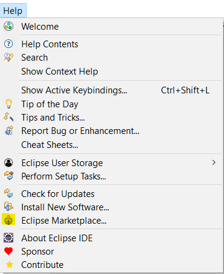

 - Find Spring boot and download Spring boot 4:

  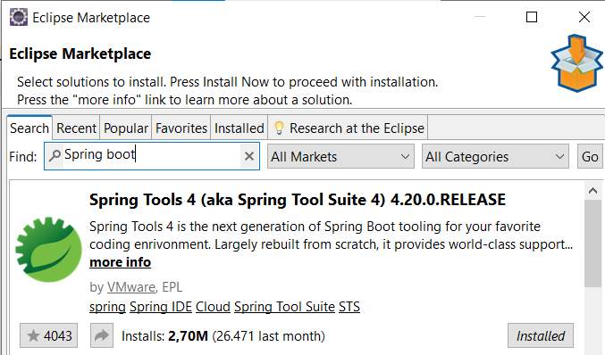

 - Now the installer ask you to accept some things, accept all and continue.

<a name="start-the-project"></a>

### Open the project

 Now that we have installed the eclipse, restart it and open the project with the ID. BE CAREFUL, open the project in the main folder, not in the backend.

 If the project doesn't show like this, go to File / Open Projects from File System:

 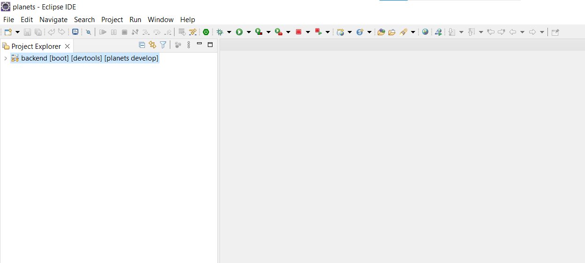

 Go to Choose Dyrectory... and select again the MAIN FOLDER: PlanetDiscovery.
 <br/>
 Now you are going to see the projects under the source, select the project and import, If it doesn't appear again restart the IDE and it will appear

 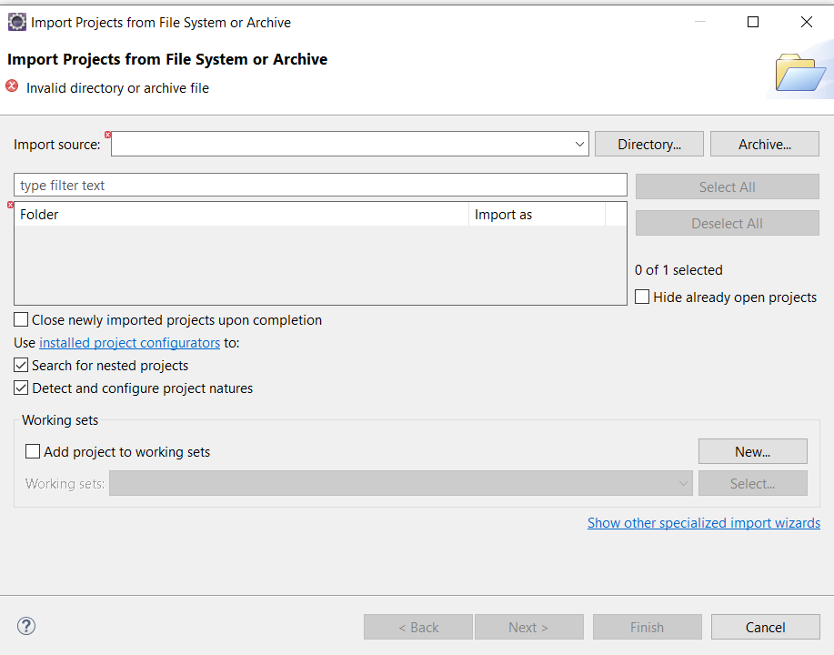

4. Start MySQL Workbech and create the database and tables with the query:

In the project you have a folder named db, inside you will see an sql file, open it with MYSQL Workbench and execute it. I included some demo data.
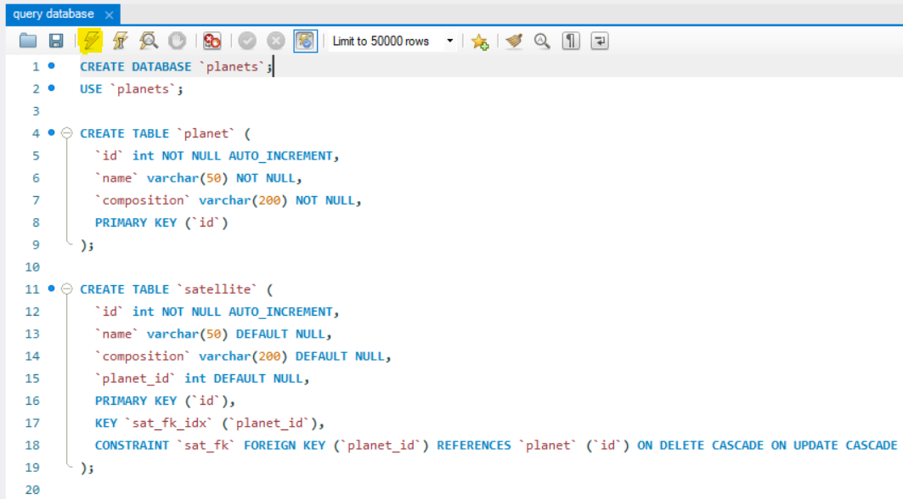


Now Go to the eclipse project, src/main/resources and open the application-properties file and write your userName and password

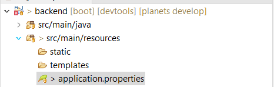

The first highlighted line is the database, in this case the database is the same as the created before
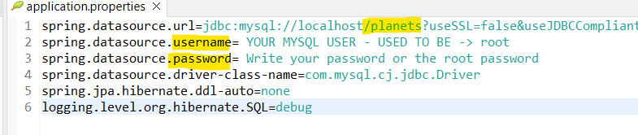


Now you have all done, start the proyect in the frontend directory

    ```sh
    ionic serve
    ```

And start the backend like the image:

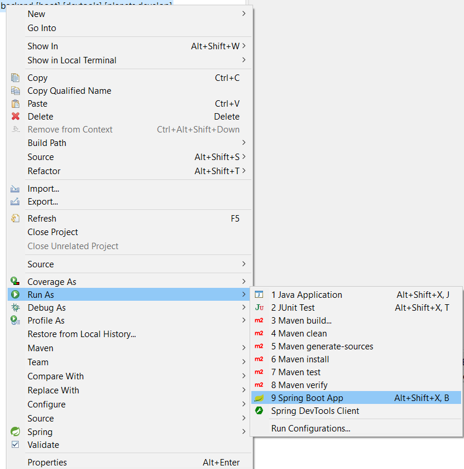

<p align="right">(<a href="#readme-top">back to top</a>)</p>

<!-- Other punctuations -->
## Other punctuations:

I made a many to one relation in the backend, this is made by taking the foreign key in the table with many and making the relation with the other table like this:

In the model package and the Satellite Class set an attribute with the annotation @ManyToOne and put the getters and setters of it.

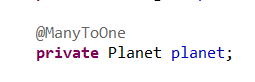

Now is the same with the Planet class, add an attribute of Satellite with the annotation @OneToMany and its respective getters and setters but now add @JsonIgnore and the table mapped
 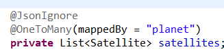

Now in the satteliteDao you will need to make the query of some functions, in this case this is the GET of all the satellites that are orbiting the planet by the id

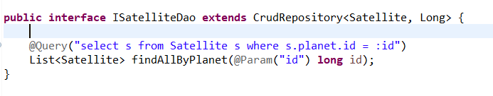

And that's all, whe have the tables related, the next thing it to make the crud using the function and others in the Services and Controllers.

<p align="right">(<a href="#readme-top">back to top</a>)</p>

<!-- CONTACT -->
## Contact

Javier Padrón García -- padrongarciajavier04@gmail.com

Project Link: [https://github.com/JavierPadronGarcia/PlanetDiscovery.git](https://github.com/JavierPadronGarcia/PlanetDiscovery.git)

<p align="right">(<a href="#readme-top">back to top</a>)</p>

<!-- ACKNOWLEDGMENTS -->
## Acknowledgments

* [Ionic icons]

* [postman] <-- to test the CRUD in the backend

<p align="right">(<a href="#readme-top">back to top</a>)</p>

<!-- URL for images and links -->
[Angular]: https://img.shields.io/badge/angular-%23DD0031.svg?style=for-the-badge&logo=angular&logoColor=white
[Angular-url]: https://angular.io

[Ionic]:https://img.shields.io/badge/Ionic-%233880FF.svg?style=for-the-badge&logo=Ionic&logoColor=white
[Ionic-url]: https://ionicframework.com

[Spring]:https://img.shields.io/badge/spring-%236DB33F.svg?style=for-the-badge&logo=spring&logoColor=white
[Spring-url]:https://spring.io

[Ionic icons]: https://ionic.io/ionicons
[postman]: https://www.postman.com
[workspace]: https://www.postman.com/javier2/workspace/planetdiscovery-javier-padrn-garca/collection/29809597-f0daeed2-0f0e-447d-989d-d20af08bd46d?action=share&creator=29809597

[Visual Studio Code]: https://code.visualstudio.com
[eclipse IDE]: https://www.eclipse.org/downloads/