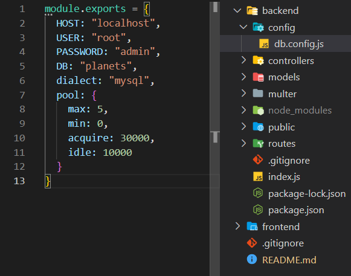
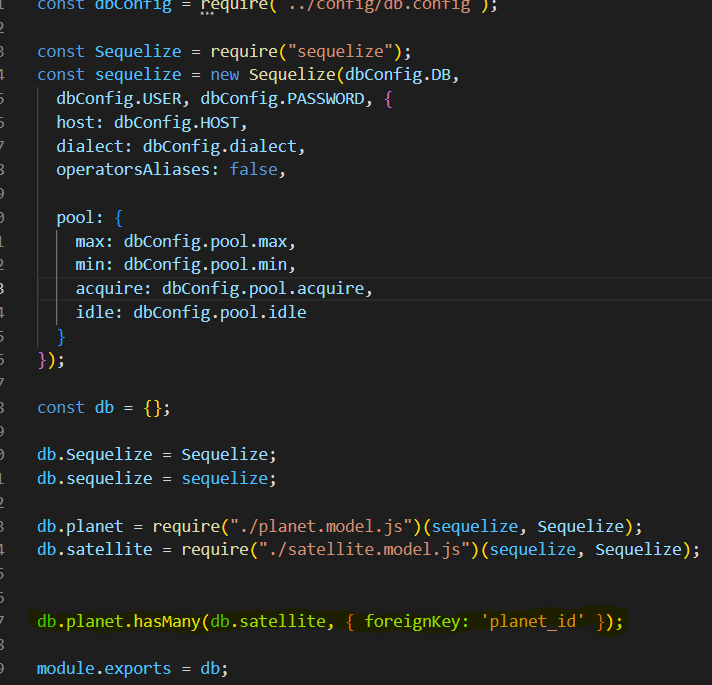
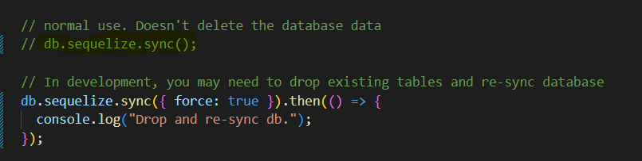

# PlanetDiscovery

<a name="readme-top"></a>

<!-- TABLE OF CONTENTS -->
<details>
  <summary>Table of Contents</summary>
  <ol>
    <li>
      <a href="#about-the-project">About The Project</a>
      <ul>
        <li><a href="#built-with">Built With</a></li>
      </ul>
    </li>
    <li>
      <a href="#getting-started">Getting Started</a>
      <ul>
        <li><a href="#prerequisites">Prerequisites</a></li>
        <li><a href="#installation">Installation</a></li>
      </ul>
    </li>
    <li><a href="#contact">Contact</a></li>
    <li><a href="#acknowledgments">Acknowledgments</a></li>
  </ol>
</details>

<!-- ABOUT THE PROJECT -->
## About The Project

PlanetDiscovery is a project that consists of a hybrid mobile application developed with Ionic and Angular that consumes a REST API created in Nodejs with express. The REST API provides CRUD (Create, Read, Update, Delete) operations on a MySQL database that contains information about planets in the solar system.

The backend is responsible for managing the database and providing CRUD operations through a REST API. The Ionic and Angular frontend is responsible for displaying planet information and allowing the user to perform CRUD operations.

The project is divided into two main parts:

- Backend: Creating the MySQL database. Implementing CRUD operations in the REST API.

- Frontend: Creating the application views. Implementing the business logic for CRUD operations.


The application allows the user to perform the following operations:

- List planets: The application displays a list of all planets in the solar system.
- View planet details: The application displays the details of a selected planet.
- Create a new planet: The application allows the user to create a new planet.
- Update a planet: The application allows the user to update the data of an existing planet.
- Delete a planet: The application allows the user to delete a planet.
- And the same with satellites in relation with the planets including the posibility to change the planet associated with its satellite

The project was developed following software development best practices. A decoupled architecture was used to separate the backend from the frontend. Additionally, a relational database was used to store planet information.
</br></br>

The backend was tested with postman, click here to see the [workspace]

### Built With

* [![Angular][Angular]][Angular-url]
* [![Ionic][Ionic]][Ionic-url]

<p align="right">(<a href="#readme-top">back to top</a>)</p>

<!-- GETTING STARTED -->
## Getting Started


### Prerequisites

- Have a text editor like [Visual Studio Code]

- Have installed the lastest lts version of node js

you can see what version is installed with:

 ```sh
  node --version
  ```

If you don't have node js <a href='https://nodejs.org/en'>click here</a> to install it

### Installation

1. Clone the repo
   ```sh
   git clone https://github.com/JavierPadronGarcia/PlanetDiscovery.git
   ```
2. go to the new folder and Install NPM packages
   ```sh
   cd PlanetDiscovery/frontend
   npm install
   ```

3. Go to the backend folder and install the npm packages:

 ```sh
   cd PlanetDiscovery/backend
   npm install
   ```

<a name="start-the-project"></a>

### Open the project

 Now we cave installed all the necessary packages we neet to set up the database, to do this follow this steps:

4. Start MySQL Workbech and create the database:

The database is named: "planets"

Now Go to the backend folder and set up your mysql propperties, probably you will need to change the user and the password:

Go to this folder and change the propperties to yours:



Now you have all done, start the proyect in the frontend directory

    ```sh
    ionic serve
    ```

And start the backend:

  ```sh
    node index.js
  ```

<p align="right">(<a href="#readme-top">back to top</a>)</p>

<!-- Other punctuations -->
## Other punctuations:

I made a many to one relation in the backend, this is made by taking the foreign key in the table with many and making the relation with the other table like this:

In the js file in the directory: "backend/models/index.js" you will see the models, here i made a many to one relation using one line:




Here you see that I made a relation with the planet_id collumn, when the project starts, the sequelize read this and create the database automatically
and create the relations.

## Save the database data:

To save the database data you will need to comment and uncomment some lines in the main index.js:



You will need to uncomment the highlighted line and comment the other lines in the image, and start the backend again.

BE CAREFUL, If you are starting the project for the first time don't change the comments because the non hihglighted lines create the tables in the database.

<p align="right">(<a href="#readme-top">back to top</a>)</p>

<!-- CONTACT -->
## Contact

Javier Padrón García -- padrongarciajavier04@gmail.com

Project Link: [https://github.com/JavierPadronGarcia/PlanetDiscovery.git](https://github.com/JavierPadronGarcia/PlanetDiscovery.git)

<p align="right">(<a href="#readme-top">back to top</a>)</p>

<!-- ACKNOWLEDGMENTS -->
## Acknowledgments

* [Ionic icons]

* [postman] <-- to test the CRUD in the backend

<p align="right">(<a href="#readme-top">back to top</a>)</p>

<!-- URL for images and links -->
[Angular]: https://img.shields.io/badge/angular-%23DD0031.svg?style=for-the-badge&logo=angular&logoColor=white
[Angular-url]: https://angular.io

[Ionic]:https://img.shields.io/badge/Ionic-%233880FF.svg?style=for-the-badge&logo=Ionic&logoColor=white
[Ionic-url]: https://ionicframework.com

[Ionic icons]: https://ionic.io/ionicons
[postman]: https://www.postman.com
[workspace]: https://solar-crater-323676.postman.co/workspace/planets~44001add-1ba8-4d50-b395-2846c91cdb91/collection/29809597-a1e4a24d-0c8e-4280-acb9-5419613880a3?action=share&creator=29809597

[Visual Studio Code]: https://code.visualstudio.com